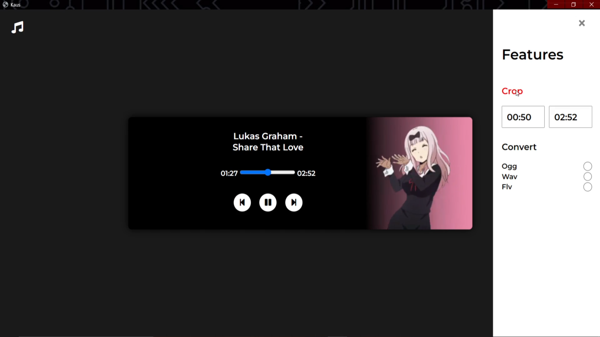
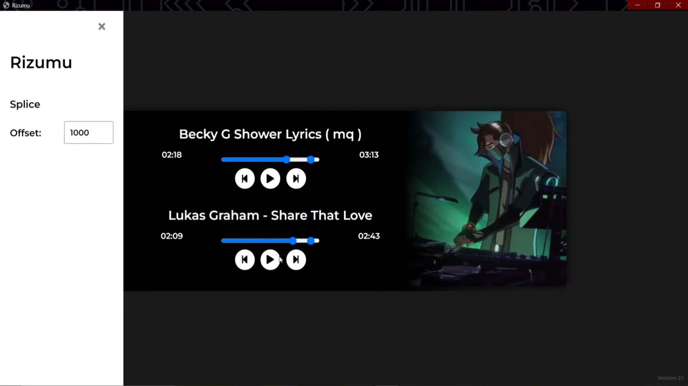

### Mahoron
Designed a server-based music player using Eel.js and Python, enabling advanced song playback and track operations. Implemented user-centric features, improving the overall music engagement experience

*Eel.js, JavaScript, Python*

#### First Look

  

#### Instructions

<li> Install Requirements
<li> Fix choice of icons
<li> College project not seamless </li>
<li> Potential for refinement </li>
<li> Nonetheless proud, Because it helped me learn the basics of Eel aka python backend</li>

