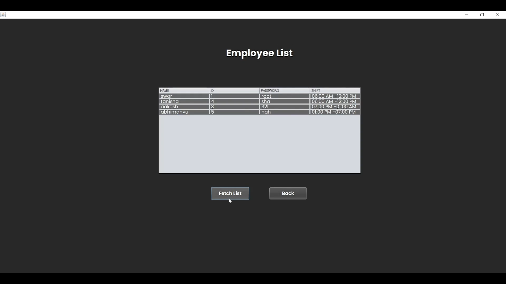

## Parking Management

For a college project, my team used NetBeans and Java to build an app that tracks customer vehicles and figures out how much they owe based on their parking time. We set up a SQL database to store all the data. Employee logins allow the staff to access the information and make changes easily. The interface looks sharp and works well. Overall, it gets the job done of logging cars and charging fees without any hassle for the employees or customers.

#### Preview 

  

  

  
Updates Dynamically

  
Future QR implementation here

  
Fare is calculated based on current time

  

#### Future Scope

The idea was to eventually connect it to a QR code system. Customers could scan a code to check in when they park. The system would capture the time and match it to their vehicle. When they leave, they'd scan another code to auto-check them out. This would save time for both the customer and employees.
